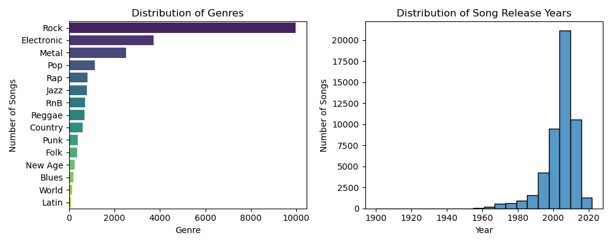
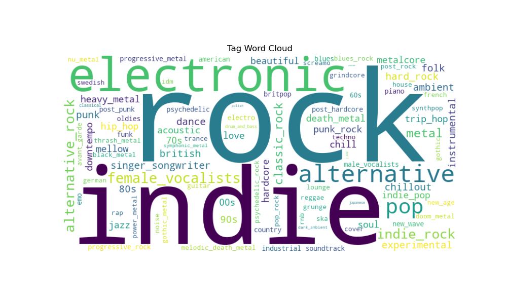
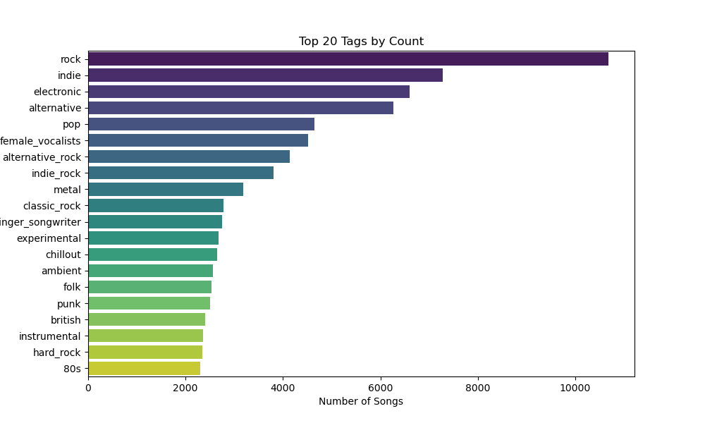
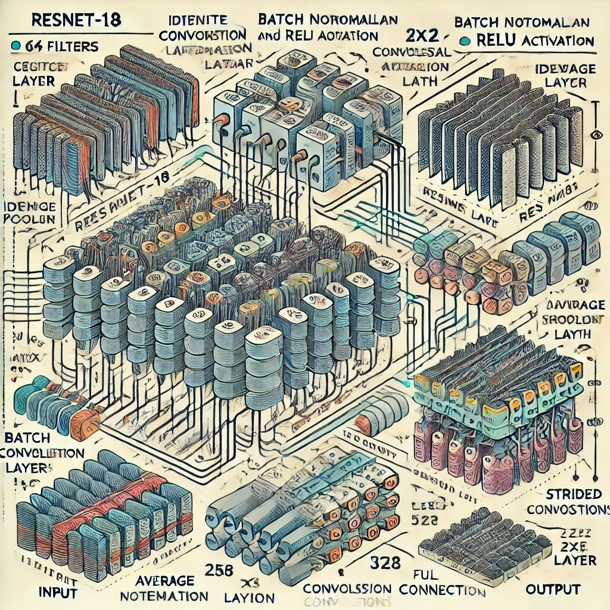
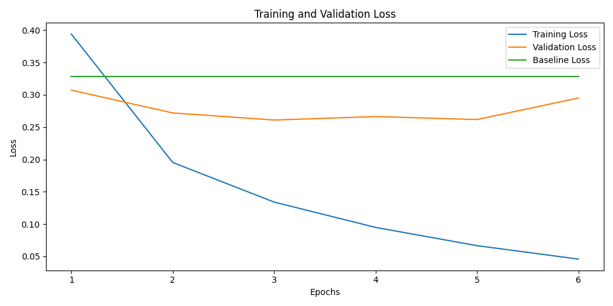

# Good Composers Borrow, Great Composers Steal
## *Analyzing Audio Similarity using Deep Learning*
#### Authors: Emelie Curl, Tong Shan, Glenn Young, Larsen Linov, Reginald Bain
## Summary
We worked on developing a model using several different approaches to analyze the similarity between songs by directly analyzing the audio. Using audio analysis techniques such as calculating log-mel spectrograms, audio augmentation, and transfer learning we established a way to compare the similarity between audio files for the purpose of detecting potential  plagiarism. Our work focuses on minimizing the so-called *triplet-loss* which aims to maximize the distance between images that are different while simultaenously minimizing the distance between similar images.
## Background
Throughout music history, composers and song writers have borrowed musical elements from each other. Similar chord progressions, rhythms, and melodies can often be found spanning different musical styles, genres, and eras. Our interest in the topic was sparked by many famous examples of composers throughout history borrowing musical structures and motifs from each other. One can hear obvious similarities in the works of Bach and Vivaldi from the baroque era and Mozart/Hayden from the classical era. In the music for Star Wars in 1977, John Williams incorporated similar leitmotifs as composer Igor Stravinsky used in his famous 1913 balet, *The Rite of Spring*. In modern music, courts have adjuticated disputes over similarities between songs. In 2015, for example, artists Robin Thicke and Pharrell Williams were sued for allegedly plagiarizing Marvin Gaye's song "Got to Give it Up" when writing their song "Blurred Lines." Marvin Gaye's estate ultimately won the $7.4 million case. These are just a few examples of audible similarities between musical works. Our project aimed to use deep learning to assess the similarity between music to potentially establish a more robust way to potentially detect music plagiarism.
## Dataset(s)
Our data primarily came from the Million Song Dataset as well as several Kaggle datasets where authors paired known songs with links to preview of the songs from various APIs. We also wrote scripts to find song previews where we did not already have them. We took 30s previews of the songs (in some case taking 10s clips of that 30s due to limitations in both compute and storage), and fed them into Librosa, a Python package built to work with and extract key features from audio. We ultimately focused on the audio from a set of around 50,000 songs that can be found in /data/music_info.csv, a data set containing meta data and preview links to songs from the following Kaggle dataset . This dataset also included information from the LastFM project and a handful of engineered features such as *danceability, liveness, loudness* and many others., a project that aimed to compile songs from the Million Song Dataset and calculate a variety of features ranging from genre tags as well as identify cover songs, and track various musical features of songs. Of primary interest to us was the raw audio of songs rather than meta data or features calculated using said metadata.
## Stakeholders
- Artists looking to ensure their work is not plagiarized by others
- Record companies and courts looking to have an objective measure of song similarity
- Companies looking to better classify and recommend wider arrays of music to listeners
## Key Performance Indicators (KPIs)
- The model minimizes the *triplet-loss* function between a triplet of (anchor, similar, different) audio files to the degree that it will differentite between similar and different audio files.
- The model beats a baseline of calculating the triplet-loss between audio files **without** feeding those audio files into the model. 
## EDA + Feature Engineering
- We primarily focused on a Kaggle dataset that provided nearly 50k working links to previews of songs that could be used for audio analysis. The graphs below show some basic information about the release year, genre, and other tags of the provided songs.

#### Augmenting Audio 
#### Log-Mel Spectrograms
## Modeling
### Triplet Loss

Triplet loss is a type of loss function used in machine learning, particularly in tasks involving similarity learning, such as facial recognition, image retrieval, and in your case, song similarity detection. The goal of triplet loss is to ensure that embeddings (representations) of similar items are closer together in the embedding space, while embeddings of dissimilar items are further apart.

Low Triplet Loss: Indicates that the model successfully distinguishes between similar and dissimilar items, clustering similar items close together and pushing dissimilar items further apart in the embedding space.
High Triplet Loss: Suggests that the model struggles to differentiate between similar and dissimilar items, with similar items possibly being far apart or dissimilar items being too close.

$\mathcal{L}(A, P, N) = \max\Big\{0, \,\|f(A) - f(P)\|_2 - \|f(A) - f(N)\|_2 + \alpha\Big\}$

Where:
- $A$ is the anchor sample.
- $P$ is the positive sample (a sample similar to $A$).
- $N$ is the negative sample (a sample different from $A$).
- $f(\cdots)$ represents the embedding function (e.g., a neural network).
- $\|\cdots\|_2$ denotes the Euclidean distance.
- $\alpha$ is the margin, a positive constant that ensures a gap between the positive and negative pairs.

### Transfer Learning
#### ResNet-18
- ResNet-18 is a deep convolutional neural network (CNN), widely recognized for its ability to learn rich feature representations. It has 18 layers that include convolutional layers, pooling, and fully connected layers, organized into a series of so-called *residual blocks* which aim to address vanishing gradients during backpropagation. Residual or "skip" connections bypass one or more layers to allow the input to a block to be added directly to the output after passing through the block's convolutional layers. A diagram of the the original Resnet-18 architecture is shown below, courtesy of [].

- We used ResNet-18 to create embeddings of songs tha could then be used to calculate triplet loss. In theory, the network can extract feature embeddings that capture essential characteristics of each song (through capturing features of the images of log-mel spectrograms). The model is trained to minimize a triplet loss function, which aims to make embeddings where songs labeled as similar are closer in the embedding space and embeddings of songs labeled as dissimilar are pushed further apart.

- For fun, I asked AI to generate an image of Resnet-18. Here is what it produced (it's not super useful):

#### DistilHuBERT
## Results
#### Resnet-18
- Fine tuning Resnet-18 on a dataset of 10k triplets of songs. Positive songs were generated using augmentations of the anchors and all layers of the ResNet were frozen except for the layers in the 4th and final residual block and the final fully connected layer. 
- The batch size was 64 and the learning rate was set initially at $10^{-4}$ We saw the following training/validation curves vs. the "no-model" euclidean distance baseline. At its best after 3 epochs, the validation loss was 0.2610, **a 20.5% improvement over the baseline.**

## Notable Roadblocks
#### Compute
- Any amateur deep learning project will face compute issues and this was no exception. We made use of the free GPU services offered by both Google Colab and Kaggle, but given the limited time per week the free versions offer, we had to use CPUs in many cases to test model hyperparameters, scrape data, etc. This resulted in extremely long loading times in many cases and limited (given the project timeframe) ability to test every hyperparameter and model architecture to the full extent we desired. For example, fine tuning ResNet18 on 10k triplets of songs for 10 epochs took ~24 hours, even when most model parameters were frozen.
#### Storage
- Storage was a significant limitation as well. Storing the NumPy arrays of log-mel spectrograms of 10k songs in a Pickle file takes over 10GB of storage space. When working locally without significant cloud resources, the data had to be carefully batched so as to not exceed our available hard disk space or overwhelm limited available RAM. This prevented us from trying very large batch sizes (which speeds up training in many cases). 
#### Rate Limiting
- Various APIs impose strict rate limiting often making data scraping time consuming. We used standard techniques where we could to aid with this, but to truly train deep learning architectures one needs far more data than we were able to cobble together.
## References
http://millionsongdataset.com/

https://www.kaggle.com/datasets/undefinenull/million-song-dataset-spotify-lastfm

https://www.last.fm/home

https://link.springer.com/article/10.1007/s10916-019-1475-2 