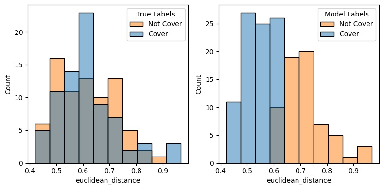
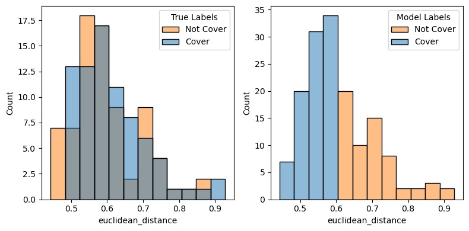
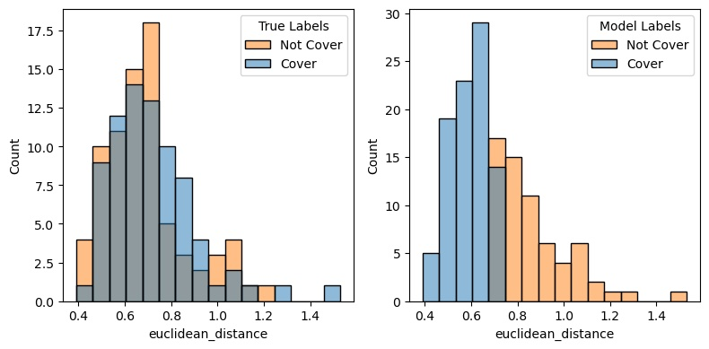

# Deployment
## Data Quality
- With data for music being difficult to acquire, store, and compute, data quality was the biggest road block in this project. 
- We trained our models (such as fine tuning ResNet-18 and training a CNN from scratch) on a set of triplets (anchors, positives, negatives) where positives were created using augmentations of the anchors and negatives are different songs chosen randomly.
- Ideally, we would have sets of triplets that include either (1) different recordings of the same song or (2) covers of songs by different groups. Such data does exist, but is not readily available for ML purposes and does not exist in high enough quantity for any meaningful training of deep learning models.
#### Creating Better Triplets
- A great deal of thought was put into how to create better triplets, and we experimented with various methods for doing so.
## Results on Real Covers
- Although our models (specifically the fine tuned ResNet-18 and CNN) performed well on our training/validation triplets described above, we wanted to try deploying the model on a set of triplets that included real covers of songs (which we would ideally have trained on if more were easily accessible). We used the Kaggle dataset found at [1], which contains songs and known covers of these songs and tailored it to our own needs. Our data set can be found at [2].
- Creating embeddings using our various models, we looked at several metrics. We calculated the nearest neighbor accuracy, which measures in how many cases did the model output embeddings where anchor and positive were closer (via euclidean distance) than anchor and negative. 
- We also looked at the distribution of euclidean distances and tried splitting pairs of song1-song2 on the mean of the distribution, classifying pairs with smaller distances than the mean as "similar" and pairs with larger differences than the mean as "not similar" and checked this against lables of whether or not they were covers of each other or just random songs. These were compared to a baseline of randomly guessing if they were covers or not. Note that the data set contains 50% pairs of covers and 50% pairs of random songs.
- ** Important Note: ** Although results do not generally beat the baseline, because of severe storage and compute limitations, we trained for only 5-10 epochs on 10,000 songs. Based on the training/validation curves we saw, with better data and more compute resources, this model approach shows promise.
#### ResNet-18 Fine Tuned - Batch Size 64, Last Residual Block Unfrozen, 8 epochs
| **Metric** | **Value** |
| ------| ------ |
| Mean Distance of Covers | 0.6142 |
| Mean Distance of NOT Covers | 0.6165 |
| Accuracy |  0.5195 |
| Precision | 0.5231 |
| F1 Score |  0.4789 |
| Recall | 0.4415 |
| Nearest Neighbor Accuracy | 38.96%|
| Baseline Accuracy | 45.45%|

#### ResNet-18 Fine Tuned - Batch Size 32, All Layers Unfrozen, 8 epochs
| **Metric** | **Value** |
| ---- | ---- |
| Mean Distance of Covers | 0.5963 |
| Mean Distance of NOT Covers | 0.6126 |
| Accuracy | 0.4610 |
| Precision | 0.4516 |
| F1 Score | 0.4029 |
| Recall | 0.3636 |
| Nearest Neighbor Accuracy | 35.06% |
| Baseline Accuracy|  54.54% |

#### CNN from Scratch -- Batch Size 32, 10 epochs
| **Metric** | **Value** |
| ---- | ---- |
| Mean Distance of Covers| 0.6915 |
| Mean Distance of NOT Covers| 0.7203|
| Accuracy| 0.4481|
| Precision| 0.4375|
| F1 Score| 0.3972|
| Recall| 0.3636|
| Nearest Neighbor Accuracy| 36.36%|
| Baseline Accuracy| 40.25%|

#### References
[1] https://www.kaggle.com/datasets/arpanpathak/original-and-cover-song-pairs

[2] https://www.kaggle.com/datasets/reggiebain/test-set-covers 
